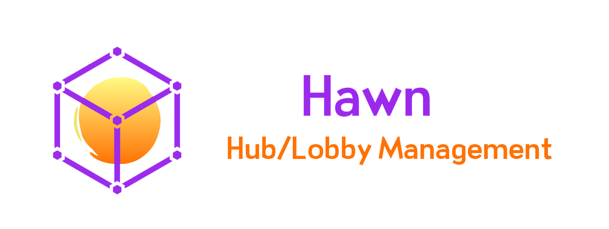

# Welcome

Hawn turns a fresh server into a ready-to-use lobby: spawns, join messages, items in the hotbar, scoreboards, tab list, protections, jump pads, a world manager and much more. Almost everything is optional and can be configured per world.


This wiki documents **Hawn 1.3 BETA**. If you are coming from 1.2 or older, read [Updating from an older version](getting-started/updating.md) first: a few behaviours change.


## Download

Hawn is available on its Spigot page: [Hawn - Hub/Lobby Management](https://www.spigotmc.org/resources/hawn-hub-lobby-management.66907/).

## Supported versions

| Server         | Versions                                   |
| -------------- | ------------------------------------------ |
| Spigot / Paper | **1.16.5 → 1.21.x → 26.x** (a single jar) |
| Java           | 8+ (whatever your server version requires) |

Hawn does not use NMS code anymore, everything goes through the Bukkit/Spigot API, so the same jar works on every supported version.

Optional integrations: [PlaceholderAPI, WorldGuard 7+, MVdWPlaceholderAPI and BattleLevels](integrations/hooks.md), plus [BungeeCord/Velocity](integrations/bungeecord.md) for server switching.

## What Hawn can do

<table data-view="cards"><thead><tr><th></th><th></th><th data-hidden data-card-target data-type="content-ref"></th></tr></thead><tbody>
<tr><td><strong>Spawns and warps</strong></td><td>Unlimited named spawns, a default spawn, a first-join spawn, a VIP spawn, spawn groups to spread the players, warps, teleport delays.</td><td><a href="features/spawns.md">spawns.md</a></td></tr>
<tr><td><strong>Join and quit</strong></td><td>Messages per group or per world, MOTD, titles, action bar, boss bar, fireworks, sounds, potion effects, commands.</td><td><a href="features/join-and-quit.md">join-and-quit.md</a></td></tr>
<tr><td><strong>Custom join items</strong></td><td>Server selector, player heads, books, armour, a "hide players" item, a lobby bow and a fun gun.</td><td><a href="features/custom-join-items.md">custom-join-items.md</a></td></tr>
<tr><td><strong>Scoreboards and tab list</strong></td><td>Unlimited animated scoreboards (per world and per permission) and an animated tab list.</td><td><a href="features/scoreboards.md">scoreboards.md</a></td></tr>
<tr><td><strong>Chat</strong></td><td>Colours, hex colours, emojis, mentions, anti-swear, global mute, chat delay, clear chat.</td><td><a href="features/chat.md">chat.md</a></td></tr>
<tr><td><strong>Protections</strong></td><td>No build, no damage, no drops, no hunger, no weather, no explosions... with WorldGuard region support.</td><td><a href="features/protections.md">protections.md</a></td></tr>
<tr><td><strong>Lobby fun</strong></td><td>Jump pads, double jump, coloured signs and clickable "action" signs.</td><td><a href="features/lobby-fun.md">lobby-fun.md</a></td></tr>
<tr><td><strong>World manager</strong></td><td>Create, import, unload, delete and edit worlds from a menu, with a built-in void generator.</td><td><a href="features/world-manager.md">world-manager.md</a></td></tr>
<tr><td><strong>Admin tools</strong></td><td>Admin panel, player editor, maintenance mode, emergency mode, build bypass, no-clip.</td><td><a href="features/admin-tools.md">admin-tools.md</a></td></tr>
</tbody></table>

And also: [custom commands](features/custom-commands.md) with a fully custom `/help`, [auto broadcast](features/autobroadcast.md) (chat, titles, action bar, boss bar), a [server list MOTD](features/server-list.md), [void teleportation](features/void-tp.md), [player options](features/player-options.md) (visibility, speed, fly, double jump...), around [60 commands](reference/commands.md) that you can disable one by one, a [MySQL storage](features/database.md) shared between lobbies, and full translation of every message.

## Where to start?

1. [Install Hawn](getting-started/installation.md) and follow the [welcome setup](getting-started/welcome-setup.md).
2. Read [Messages, colours and formatting](basics/message-format.md) and [Per-world options](basics/per-world-options.md): these two pages explain the syntax used in every Hawn file.
3. Give your players the [permissions](reference/permissions.md) they need. **Hawn does not give any permission by default.**


Something is missing or wrong in this wiki? Open an issue on [GitHub](https://github.com/DianoxDragon/Hawn/issues).

