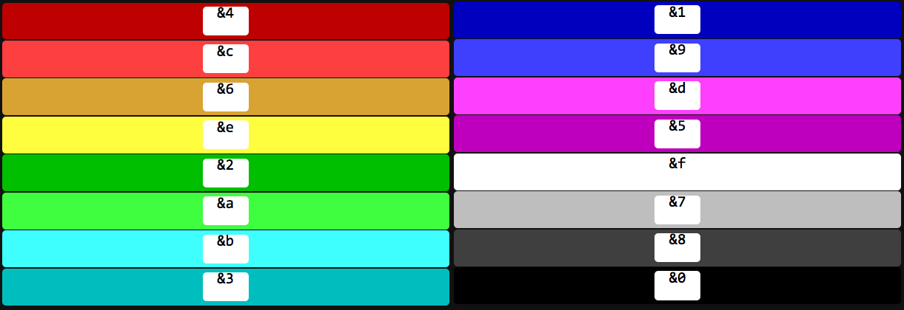
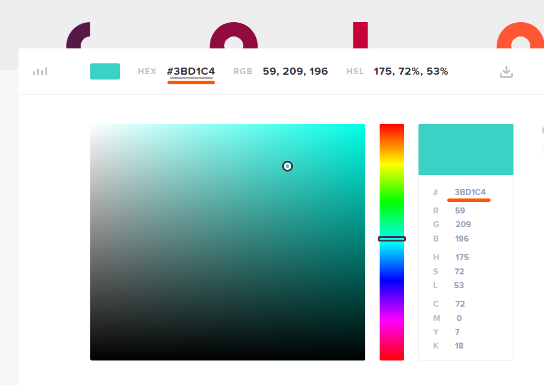

# What are the colors code?

## Classic way - (All versions -1.8.x to 1.16.1)

You can use only one type of color :



In clear to use, we have to use a code, we'll take the red so **`&4`**, and to apply the color, we have to place it at the place just before where we want the color to appear. Here is an example:

```
Here is an example that shows &4red in action
```



Although most people use the **`&`** to add color, you can also use the **`§`** to add color.


## Hex color way - (1.16.1 and after)

Not all the plugin supports this new color system, but you can insert it almost anywhere (implementation will continue as new versions are released).

To put a color with the hex method you need to put **`#<######>`**

### 1 - How to generate a color with hex

Go to this website : [https://htmlcolorcodes.com/fr/](https://htmlcolorcodes.com/fr/)\
According to the chosen color, you can retrieve a hex code as shown in the picture



### 2 - Put this color into the plugin

With the color that was chosen just before you will have to implement **`#<3BD1C4>`**\
Here is an example:

```
Here is an example that shows #<3BD1C4>color in action
```

